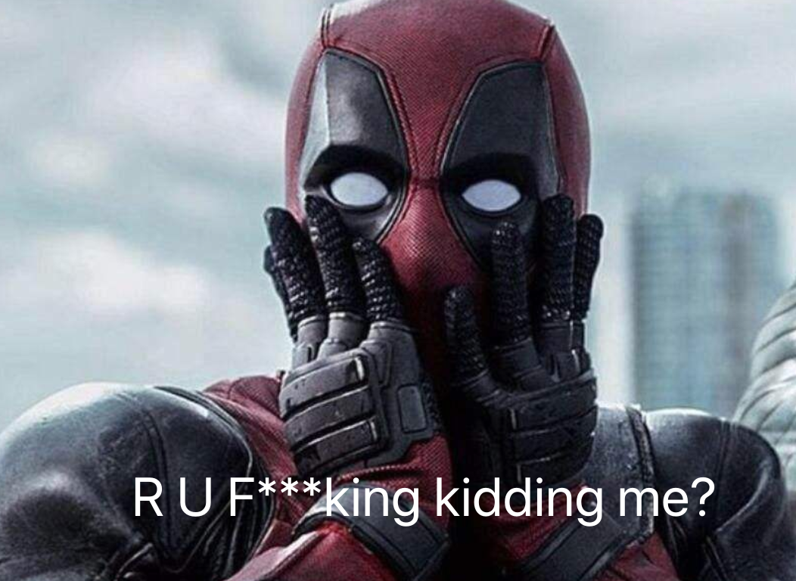
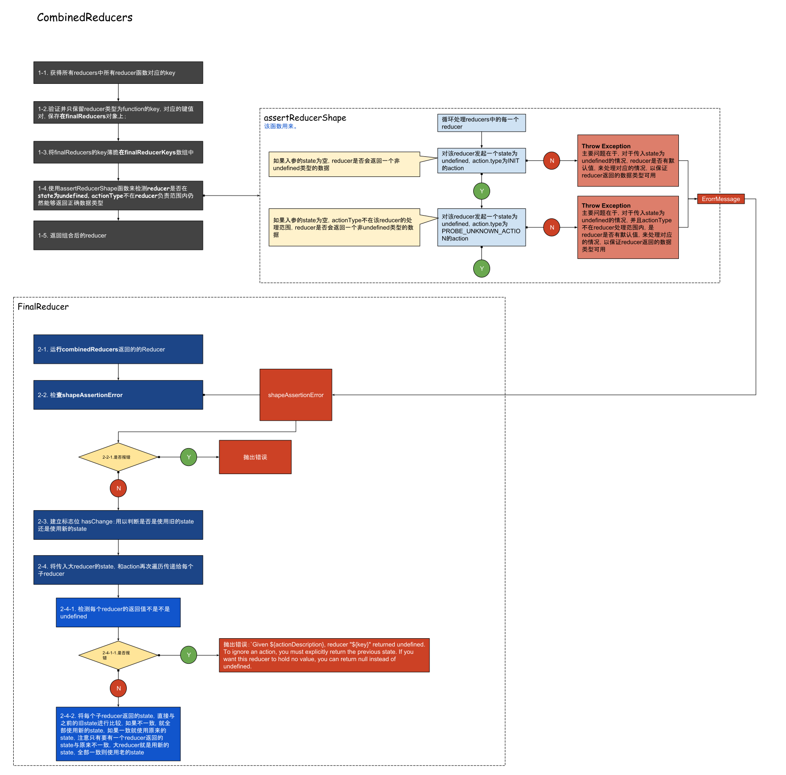

# Without UI;

## Hey, I'm sorry about this demo doesn't has a ui;

> redux不只是给React用的，任何想用redux来管理数据流的地方都可以使用redux，所以第一个demo我们没有ui.


### 第一个例子如下

```
import {createStore, combineReducers} from 'redux';

const initalState = {
	memberList : [
		{
			name: 'Seed Huang',
			age: '34 years-old'
		}
	],
	selectedIndex: 0
};

/**
* actions 可以定义一些actions types，但是不是必须的
*/
const actions = {
	addMember: Symbol.for('ADD_MEMBER'),
	selectedMember: Symbol.for('SELECTED_MEMBER')
};

const {addMember, selectedMember} = actions;


const reducer = combineReducers({
	memberList: (state = [], action) => {
		console.log(action, '>>>>>1')
		switch (action.type) {
			case addMember:
				return [
					...state,
					{
						name: 'Sky Huang',
						age: '5 years-old'
					}
				];
			default:
				return state;
		}
	},
	selectedIndex: (state = 0, action) => {
		console.log(action, '>>>>>2')
		switch (action.type) {
			case selectedMember:
				return action.index;
			default:
				return state;
		}
	}
});


const store = createStore(reducer, initalState);
const unsubscrib = store.subscribe(()=>{
	console.log(store.getState());
});

store.dispatch({type: actions.addMember});
window.$$actions = actions;
window['$$store'] = store
```

### 解释
首先本身没有什么难的，简单的说一下几个简单的概念，如果要看详细的部分，可以查看[官网文档](http://cn.redux.js.org/docs/basics/)：
- action
- reducer
- store

#### action
action其实就是一个“Plain Object”，“Plain Object”就是父级原型就是object，里面有一个字段是必须的，就是type
```
{
  type: "xxxx"
}
```

#### reducer
reducer就是一个function，用来生成对应“state tree”

##### combineReducers
combineReducers是用来将多个reducer组合在一起的方法产生一个可以处理多个reducer的新方法，这个对象需要遵循一个最简单的一个规则就是，传入的方法对应的属性名称需要和state中对应的属性一致：
###### 举个🌰
```
// state
{
  a: "1",
  b: "2"
}

// reducer Obj
{
  a: function(state = "", action) {return state},
  b: function(state = "", action) {return state}
}
```

> ⚠️ 这里有一个很重要的点要记住，combineReducer中的每一个子reducer的state必须要有一个默认值，否则会报错，即使设置了preloadedState也没有用，因为preloaded是在combineReducer运行之后产生，并不是默认值的意思，主要是用来生成上一次已经保存的数据，或者服务器已经有的数据，他的执行顺序在reducer执行完之后，每个对应的属性的返回值不能为undefined，否则会报错
>
> ❌ Uncaught Error: Reducer "selectedIndex" returned undefined during initialization. If the state passed to the reducer is undefined, you must explicitly return the initial state. The initial state may not be undefined. If you don't want to set a value for this reducer, you can use null instead of undefined.

上述错误来自于combinedReducer中的一个自检程序 **combinedReducers -> assertReducerShape**
中会通过assertReducerShape方法来检查reducer返回数据结构以此来判断初始状态（initialState）和action.type处理丰富度是否达到标准，如在一个未知的action.type下，是否还是能够有有效的返回值，正是由于这个检查，才能检查出reducer state没有设置默认值就会报错的情况

#### store
store是通过createStore的方法生成出来，每个app就一个store，用于存储state tree，

##### dispatch
store上有dispatch方法，是唯一一个可以触发改变state tree的方法

##### subscribe/unsubscribe
**subscribe**：添加dispatch之后state tree改变之后监听器（一个回调函数）
**unsubscribe**：删除对应的订阅监听器

### combinedReducer

